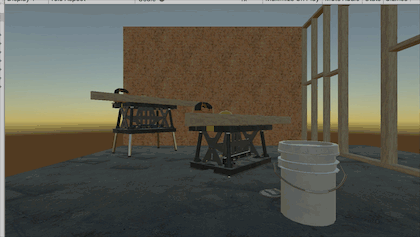
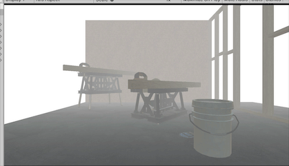

# Shader_For_Beginer
 纹理，灯光，阴影，法线地图，发光物体，环境遮挡，反射，折射等基础3D技术栈
 
 Unity version : 2020.3 on master branch \
Tested with : Win DX11, Mac Metal
| Scene | Image | Description |
| --- | - | --- |
| `001UVAnimation-Move` |  | UVAnimation-Move |
| `002pixel` |  | Pixel |
| `003Sharpen` |  | Sharpen |
| `004Dilation` |  | Dilation |
| `005FilmGrain` |  | FilmGrain |
| `007fog` |  | fog |
| `008blur` |  | blur |
| `009bloom` |  | bloom |
| `011motionblur` |  | motionblur |

-------------
References / Useful Links:
